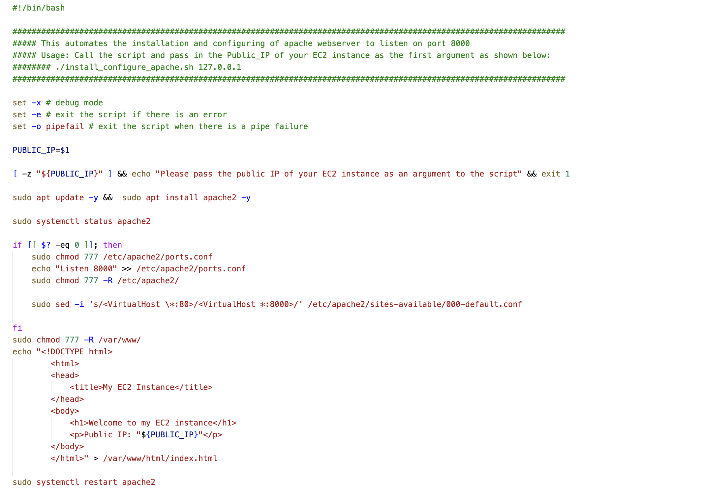

# Automating Load balancer Configuration With Shell Scripting

## Introduction

Automating Load balancer Configuration With Shell Scripting refers to the process of using shell scripts to automate the setup and management of load balancers in a computing environment. These scripts are designed to streamline the often complex and repetitive tasks associated with configuring load balancers, such as defining routing rules and server pools.


By automating load balancer configuration, Engineers can achieve greater efficiency and scalability in their network infrastructure, reducing the risk of human errors and improving overall system reliability. This approach is particularly valuable in DevOps and cloud computing environments, where rapid and consistent load balancer setup is essential for optimizing resource allocation and application performance.


## Automate the deployment of web servers:

> We will be writing a script that automates the installation and configuration of the Apache web server to listen on port 8000. It does this by updating the package list, installing the Apache2 package, checking if the Apache2 service is running, and modifying the necessary configuration files. It also creates an index.html file in the /var/www/html directory with a welcome message and the public IP address of the EC2 instance. Finally, it restarts the Apache2 service.



> We will also be writing another script that automates the configuration of Nginx to act as a load balancer. It does this by installing Nginx, creating a new configuration file, and modifying it to specify the upstream servers and configure Nginx to listen on port 80. It then tests the configuration and restarts the Nginx service.


## Deploying and configuring web servers


### Step 1: Provision an EC2 instance running ubuntu 20.04. 

> Open your AWS Management Console, click on EC2. Scroll down the page and click on Launch instance:


> Under Applications and OS Images, click on quick start and click on ubuntu:


> Instances launched


### Step 2: Open port 8000 to allow traffic from anyhere using the security group. 
To secure web traffic on port 8000, modify the associated security group's rules within the AWS EC2 dashboard, ensuring that access is restricted to trusted sources.

> Select your instance, scroll down the security tab, and select instance security group


> Modify access to allow traffic on port 8000


### Step 3: Connect to the webserver via the terminal using SSH cleint.``

> If you're using your local terminal, navigate to the directory containing your key pair:

 ```
 cd ./folder-containing-key-pair
 ```

> Run this command, if necessary, to ensure your key is not publicly viewable:

```
chmod 400 key-pair.pem

```

> Connect to your instance using its Public DNS:

```

ssh -i "key-pair.pem" ubuntu@your-instance-public-dns
```

### Step 4: Open a file by running

```
sudo nano install_configure_apache.sh
```

### Step 5: Paste the script below.
```
#!/bin/bash

####################################################################################################################
##### This automates the installation and configuring of apache webserver to listen on port 8000
##### Usage: Call the script and pass in the Public_IP of your EC2 instance as the first argument as shown below:
######## ./install_configure_apache.sh 127.0.0.1
####################################################################################################################

set -x # debug mode
set -e # exit the script if there is an error
set -o pipefail # exit the script when there is a pipe failure

PUBLIC_IP=$1

[ -z "${PUBLIC_IP}" ] && echo "Please pass the public IP of your EC2 instance as an argument to the script" && exit 1

sudo apt update -y &&  sudo apt install apache2 -y

sudo systemctl status apache2

if [[ $? -eq 0 ]]; then
    sudo chmod 777 /etc/apache2/ports.conf
    echo "Listen 8000" >> /etc/apache2/ports.conf
    sudo chmod 777 -R /etc/apache2/

    sudo sed -i 's/<VirtualHost \*:80>/<VirtualHost *:8000>/' /etc/apache2/sites-available/000-default.conf

fi
sudo chmod 777 -R /var/www/
echo "<!DOCTYPE html>
        <html>
        <head>
            <title>My EC2 Instance</title>
        </head>
        <body>
            <h1>Welcome to my EC2 instance</h1>
            <p>Public IP: "${PUBLIC_IP}"</p>
        </body>
        </html>" > /var/www/html/index.html

sudo systemctl restart apache2

```

### Step 6: Save and close the file by pressing `CTRL+X` then `Y` for Yes and `Enter`.

### Step 7: Change the permissions on the file to make an executable using the command below:

```
    sudo chmod +x install_configure_apache.sh
```

### Step 8: Run the shell script using the command below. Make sure you read the instructions in the shell script to learn how to use it.

```
    ./install_configure_apache.sh EC2_PUBLIC_IP
```


## Deploying and configuring Nginx Load Balancer


### Step 1: Provision a new EC2 instance running ubuntu 22.04. 


> Make sure port 80 is opened to accept traffic from anywhere. 


> Instance launched


> Next SSH into the instance

* If you're using your local terminal, navigate to the directory containing your key pair:
 ```
 cd ./folder-containing-key-pair
 ```
* Run this command, if necessary, to ensure your key is not publicly viewable:
```
chmod 400 docker.pem
```
* Connect to your instance using its Public DNS:
```
ssh -i "key-pair.pem" ubuntu@your-instance-public-dns
```
* If you're prompted to answer a question, choose `yes`


### Step 2: On your terminal, open a file configure_nginx_loadbalancer.sh using the command below:

```
sudo nano configure_nginx_loadbalancer.sh
```

### Step 3: Copy and Paste the script below inside the file:

```

#!/bin/bash

######################################################################################################################
##### This automates the configuration of Nginx to act as a load balancer
##### Usage: The script is called with 3 command line arguments. The public IP of the EC2 instance where Nginx is installed
##### the webserver urls for which the load balancer distributes traffic. An example of how to call the script is shown below:
##### ./configure_nginx_loadbalancer.sh PUBLIC_IP Webserver-1 Webserver-2
#####  ./configure_nginx_loadbalancer.sh 127.0.0.1 192.2.4.6:8000  192.32.5.8:8000
############################################################################################################# 

PUBLIC_IP=$1
firstWebserver=$2
secondWebserver=$3

[ -z "${PUBLIC_IP}" ] && echo "Please pass the Public IP of your EC2 instance as the argument to the script" && exit 1

[ -z "${firstWebserver}" ] && echo "Please pass the Public IP together with its port number in this format: 127.0.0.1:8000 as the second argument to the script" && exit 1

[ -z "${secondWebserver}" ] && echo "Please pass the Public IP together with its port number in this format: 127.0.0.1:8000 as the third argument to the script" && exit 1

set -x # debug mode
set -e # exit the script if there is an error
set -o pipefail # exit the script when there is a pipe failure


sudo apt update -y && sudo apt install nginx -y
sudo systemctl status nginx

if [[ $? -eq 0 ]]; then
    sudo touch /etc/nginx/conf.d/loadbalancer.conf

    sudo chmod 777 /etc/nginx/conf.d/loadbalancer.conf
    sudo chmod 777 -R /etc/nginx/

    
    echo " upstream backend_servers {

            # your are to replace the public IP and Port to that of your webservers
            server  "${firstWebserver}"; # public IP and port for webserser 1
            server "${secondWebserver}"; # public IP and port for webserver 2

            }

           server {
            listen 80;
            server_name "${PUBLIC_IP}";

            location / {
                proxy_pass http://backend_servers;   
            }
    } " > /etc/nginx/conf.d/loadbalancer.conf
fi

sudo nginx -t

sudo systemctl restart nginx

```

### Step 4: Save and close the file by pressing `CTRL+X` then `Y` for Yes and `Enter`.

### Step 5: Change the file permission to make it an executable using the command below:

```
sudo chmod +x configure_nginx_loadbalancer.sh
```

### Step 6: Run the bash script with the following command:

```
./configure_nginx_loadbalancer.sh Load_Balancer_PUBLIC_IP Webserver-1 Webserver-2
```

```
./configure_nginx_loadbalancer.sh 127.0.0.1 192.2.4.6:8000  192.32.5.8:8000
```


## Verify the setup
> Screenshot of Server 1

> Screenshot of Server 2

> Screenshot Load Balancer


